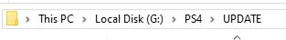
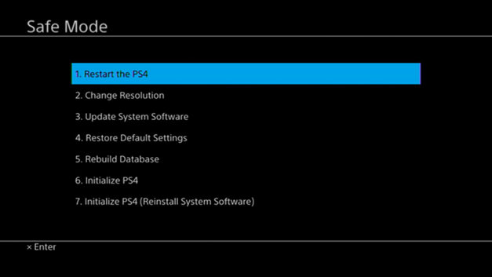
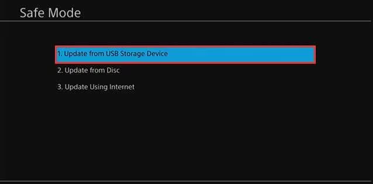

# PS4-Firware-Update-Guide          
How to update PS4 firmware manually            
           
# What are firmware update and reinstall files              
1. On the darthsternie website *Official Firmwares* are update files that let you update from for example firmware 9.50 to 9.60             
2. On the darthsternie website *Recovery Firmwares* are firmware reinstalation/recovery files that wipe the console of all user data        
# Downloading firmware                 
1. Go to [Darthsternie](https://darthsternie.net/ps4-firmwares)             
2. Download the firmware update version to which you want to update to          
3. Grab a USB flash drive and format it to EXFAT              
4. Create the following folder path on the USB PS4/UPDATE    
      
5. Then paste the downloaded file inside the UPDATE folder            
6. Plug the USB into your PS4      
7. Turn your PS4 off and then hold down the power button untill you hear a second boot tune      
8. Connect your PS4 controller to the console with a DATA TRASNFER capable micro usb cable and press the PS button       
9. Once in Safe mode choose option 3. Update System Software       
         
10. In the following menu choose option 1. Update from USB Storage Device             
        
11. Press *YES* and or *ACCEPT* to any addidional options       
             
# You can then follow one of these other guides to jailbreak your console      
1. [How to use a GUI tool to run PPPwn on Windows](https://github.com/DrYenyen/PPPwnGo-Guide)      
2. [How to set up Raspberry-Pi on Windows for PPPwn](https://github.com/DrYenyen/PPPwn-Setup-Guide-For-Raspberry-Pi)    
